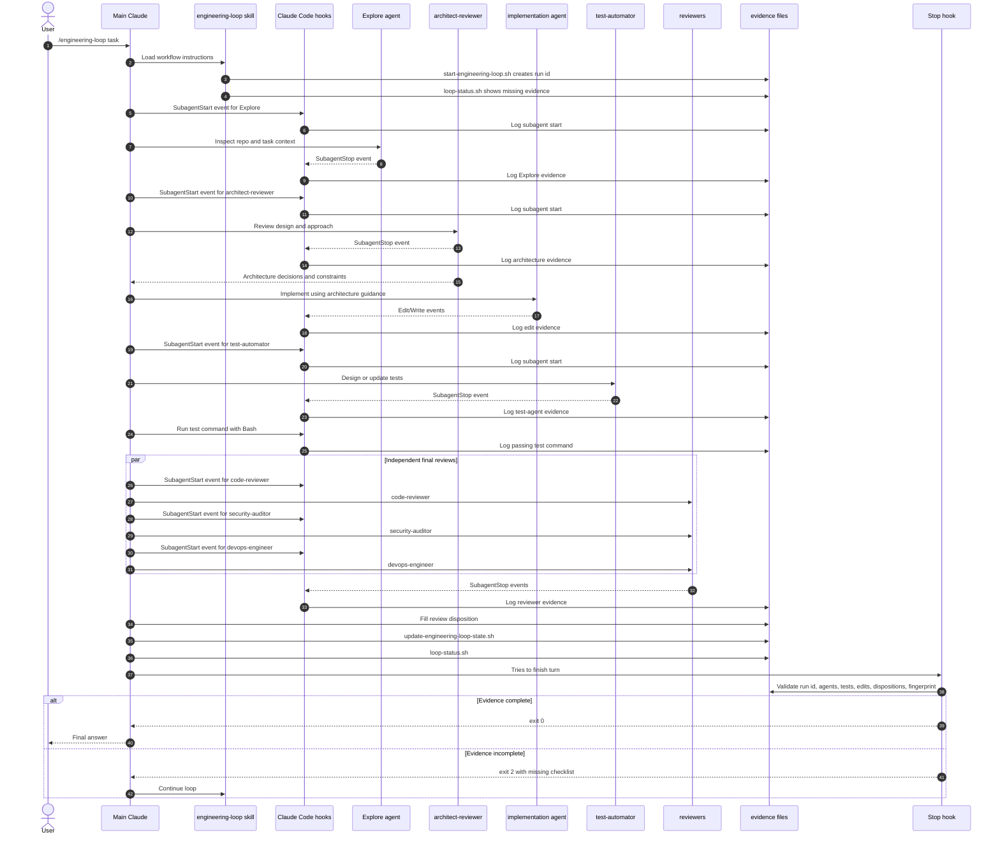

# Claude Code Engineering Loop Template

This repository shows a practical Claude Code setup for enforcing an engineering
loop with specialized subagents, evidence logs, review disposition, tests, and a
final Stop-hook gate.

The core idea is simple:

```text
Claude can only finish when the repository evidence proves the loop is complete.
```

The loop does not trust a final message like "done". It checks actual subagent
events, Bash test commands, edit timestamps, reviewer dispositions, and the
current repository fingerprint.

## What This Solves

AI coding workflows often fail in quiet ways:

- The same agent writes and reviews its own work.
- Review comments are produced but never fixed.
- Tests run before the final edit.
- The assistant says a process happened, but there is no durable evidence.
- Early planning agents look stale after implementation changes the diff.

This template addresses those gaps with:

- Dedicated agents for explore, architecture, implementation, testing, review,
  security, and DevOps.
- Hook-recorded evidence for subagents, Bash commands, and edits.
- A loop run id that ties planning evidence to one workflow run.
- A review-disposition file that forces every reviewer finding to be fixed,
  accepted as risk, or marked not applicable with evidence.
- A Stop hook that blocks the final response until the checklist passes.

## Quick Start

Install into another repository:

```bash
git clone https://github.com/phaniuk111/claude-code-engineering-loop-template.git
cd claude-code-engineering-loop-template
./install.sh /path/to/target-repo
```

Start Claude Code in the repo:

```bash
claude
```

For local end-to-end testing where you do not want approval prompts:

```bash
claude --dangerously-skip-permissions
```

Then run a task through the project command:

```text
/engineering-loop --mode code Make a harmless smoke-test Python change: add loop_smoke_example.py with add(a: int, b: int) -> int and pytest coverage.
```

For validation-only or next-step planning tasks, use analysis mode:

```text
/engineering-loop --mode analysis Validate this repository and recommend the next steps. Do not change code.
```

Claude should run the workflow, update evidence files, and only finish after:

```bash
.claude/hooks/engineering-loop-stop.sh
```

exits successfully.

## Repository Structure

| Path | Type | Who Runs Or Reads It | Purpose |
|---|---|---|---|
| `.claude/commands/engineering-loop.md` | Slash command | Claude Code command system | Starts the `/engineering-loop` workflow. |
| `.claude/skills/engineering-loop/SKILL.md` | Skill instructions | Claude | Defines the required sequence: start, Explore, architect, code, test, review, disposition, state, status, Stop. |
| `.claude/skills/engineering-loop/scripts/start-engineering-loop.sh` | Skill helper script | Claude, because the skill tells it to | Creates the active loop run id. |
| `.claude/skills/engineering-loop/scripts/loop-status.sh` | Skill helper script | Claude and the Stop hook | Prints completed and missing evidence; exits `2` when incomplete. |
| `.claude/skills/engineering-loop/scripts/update-review-disposition-template.sh` | Skill helper script | Claude, after reviewers run | Creates the reviewer-disposition skeleton. |
| `.claude/skills/engineering-loop/scripts/update-engineering-loop-state.sh` | Skill helper script | Claude, near the end | Builds checklist state from actual evidence. |
| `.claude/hooks/remind-engineering-loop.sh` | Real Claude Code hook | `UserPromptSubmit` | Reminds Claude to use the loop for non-trivial work. |
| `.claude/hooks/pre-tool-use/block-dangerous-commands.sh` | Real Claude Code hook | `PreToolUse` for Bash | Blocks dangerous shell commands. |
| `.claude/hooks/pre-tool-use/protect-sensitive-files.sh` | Real Claude Code hook | `PreToolUse` for Read/Edit/Write/MultiEdit | Protects secrets and protected loop files while allowing review disposition edits. |
| `.claude/hooks/log-subagent-start.sh` | Real Claude Code hook | `SubagentStart` | Records when a subagent is spawned. Useful for traceability, not completion proof. |
| `.claude/hooks/log-subagent-stop.sh` | Real Claude Code hook | `SubagentStop` | Records which subagent actually ran, with run id and fingerprint. |
| `.claude/hooks/log-bash-tool.sh` | Real Claude Code hook | `PostToolUse` and `PostToolUseFailure` for Bash | Records commands and detects test commands. |
| `.claude/hooks/log-edit-tool.sh` | Real Claude Code hook | `PostToolUse` and `PostToolUseFailure` for edits | Records edit/write evidence and timestamps. |
| `.claude/hooks/post-tool-use/ruff-format.sh` | Real Claude Code hook | `PostToolUse` for Python edits | Runs Ruff fix/format when available. |
| `.claude/hooks/engineering-loop-stop.sh` | Real Claude Code hook | `Stop` | Final gate that blocks Claude from finishing unless the loop evidence passes. |
| `.claude/settings.json` | Claude Code config | Claude Code | Wires hooks to lifecycle events. |
| `.claude/settings.local.example.json` | Optional local permissions example | Human operator | Copy to `.claude/settings.local.json` when you want to pre-allow the loop helper scripts locally. |
| `.claude/agents/*.md` | Project agents | Claude Code subagent system | Defines the specialized agents used by the loop. |
| `.claude/engineering-loop-config.json` | Loop config | Loop scripts | Defines required agent groups and test-command patterns. |
| `.claude/engineering-loop-*.json/.jsonl/.sha` | Generated evidence | Hook/helper scripts | Runtime proof files for one or more loop runs. These are ignored by git. |
| `CLAUDE.md` | Project guidance | Claude | Standing instruction that non-trivial repo work must complete the loop. |

## How The Loop Works

The loop supports two modes:

- `code` mode for implementation work. This requires implementation, testing,
  final test command evidence, reviews, dispositions, and Stop-hook validation.
- `analysis` mode for validation, audit, and next-step planning work. This
  marks implementation and test execution as `not_applicable`, but still
  requires Explore, architecture, code review, security review, DevOps review,
  reviewer dispositions, and Stop-hook validation.

The short version:

```text
/engineering-loop
  -> start loop run id
  -> inspect current missing evidence
  -> run Explore
  -> run architect-reviewer
  -> pass architect decisions to implementation agent
  -> implement
  -> run test-automator
  -> run tests
  -> run reviewers in parallel
  -> disposition every reviewer finding
  -> update state
  -> check status
  -> Stop hook validates before final answer
```



The loop logs both `SubagentStart` and `SubagentStop`. Start events are useful
for debugging orchestration because they show which agents Claude attempted to
spawn. Stop events remain the enforcement evidence because they prove the
subagent finished and returned control.

The Stop hook validates that:

- `@Explore` and `@architect-reviewer` ran in the active loop run.
- Implementation, testing, review, command, and edit evidence match the final
  repository fingerprint.
- A relevant test command passed.
- The latest passing test is newer than the latest edit.
- Every required reviewer has a disposition entry.
- Every reviewer finding is `fixed`, `accepted_risk`, or `not_applicable` with
  evidence.

## Review Disposition

Reviewers running is not enough. Their findings must be handled.

The loop requires:

```text
.claude/engineering-loop-review-disposition.json
```

Example:

```json
{
  "loop_run_id": "20260628T074407Z-57930",
  "change_fingerprint": "31e236...",
  "findings": [
    {
      "agent": "code-reviewer",
      "severity": "medium",
      "finding": "Missing mixed-sign test",
      "disposition": "fixed",
      "evidence": "Added test_add_mixed_signs and reran pytest"
    },
    {
      "agent": "devops-engineer",
      "severity": "low",
      "finding": "No pytest CI workflow exists",
      "disposition": "accepted_risk",
      "evidence": "Pre-existing repo gap; out of scope for this smoke-test change"
    }
  ]
}
```

This turns reviewer output into a real checklist instead of a suggestion that can
be ignored.

## Why Hooks And Scripts Are Separate

This repo intentionally separates two concepts:

- `.claude/hooks/` contains scripts Claude Code automatically triggers from
  lifecycle events.
- `.claude/skills/engineering-loop/scripts/` contains helper scripts Claude runs
  because the engineering-loop skill tells it to.

That split keeps the automatic hooks small and auditable while still allowing the
workflow to have helper commands.

## Validating The Setup

Run:

```bash
.claude/skills/engineering-loop/scripts/doctor.sh
```

The doctor checks that required files exist, shell scripts parse, scripts are
executable, JSON config parses, and local runtime evidence files are ignored by
git.

For lower-level checks, run:

```bash
find .claude/hooks .claude/skills/engineering-loop/scripts -type f -name '*.sh' -print0 | xargs -0 -n1 bash -n
jq empty .claude/settings.json .claude/settings.local.example.json .claude/engineering-loop-config.json
.claude/skills/engineering-loop/scripts/loop-status.sh
```

`loop-status.sh` exits `2` whenever the current repository fingerprint does not
yet have complete evidence. That is expected at the beginning of a loop.

## Notes Before Publishing

Generated loop evidence files can include local paths, transcript references, and
agent summaries. They are ignored by `.gitignore` and should generally not be
committed.

If you want to publish this as a clean template, remove local smoke-test files
and generated evidence before your first public commit.
